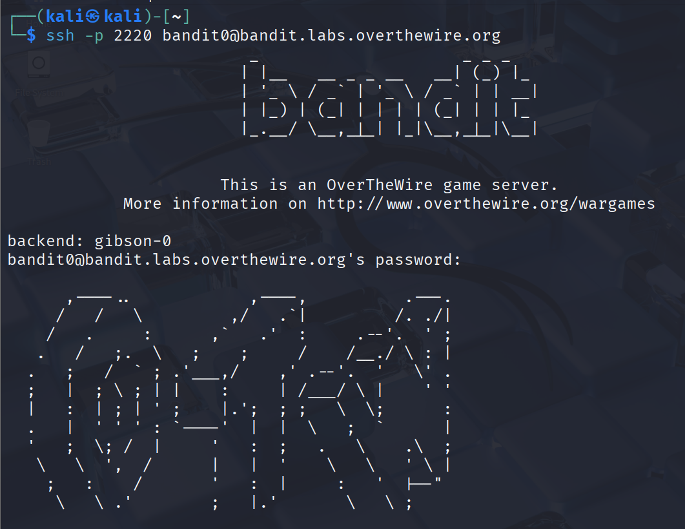
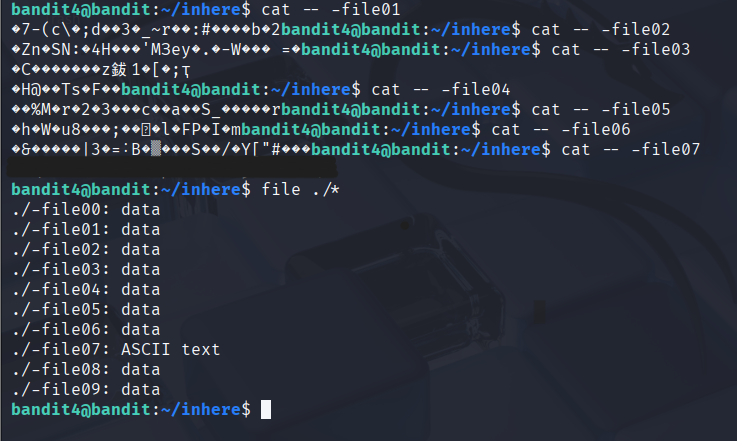

# OverTheWire Bandit: Levels 0-4 – 2026-02-18

## Session Overview
- **Time spent :** 1.5 hours (including stuck points)
- **Levels solved :** 0 to 4
- **Why this matters for real roles:** These basics mimic SOC tasks like navigating /var/log on a breached server or finding hidden payloads in user dirs. Blue team analysts deal with this daily in incident response.

## Level-by-Level Breakdown
### Level 0: SSH Login Basics
- **Commands used :**

  ```bash
  ssh -p 2220 bandit0@bandit.labs.overthewire.org
  ```
  ```Password: [redacted]```

- **What happened :** Simple login to home dir, cat readme for password.
- **Key learning :** SSH port non-standard (2220) — reminds me of scanning non-22 ports in real nmap jobs.
- **Struggles & fixes :** Forgot -p flag first → "Connection refused" error. Fixed by re-reading instructions.

### Level 1: Handling Dashes in Filenames
- **Commands used :**  
  ```bash
  ls
  cat ./-   
  or cat < -    
  ```
   ```Password: [redacted]```


- **What happened :** File named "-", cat directly fails as shell interprets as stdin.
- **Key learning :** Shell redirection tricks for weird filenames — useful for malware with obfuscated names.
- **Struggles & fixes :** Plain `cat -` hung waiting for input. Learned `< -` pipes the file content properly.

### Level 2: Spaces in Filenames
- **Commands used :**
  ```bash
  cat ./--spaces\ in\ this\ filename--  
  or cat -- "--spaces in this filename--"
  ```  
   ```Password: [redacted]```


- **What happened :** Escaped spaces to read the file.
- **Key learning :** Quoting/escaping in bash — critical for scripting log parsers that handle user-generated filenames.
- **Struggles & fixes :** Unescaped `cat spaces...` treated as multiple args → "No such file". Tested both methods.

### Level 3: Hidden Directories
- **Commands used :** 
  ```bash
  ls -a    # Show hidden  
  cd inhere  
  ls -a  
  cat .hidden
  ```
   ```Password: [redacted]```

- **What happened :** Navigated to hidden dir, found file.
- **Key learning :** Always check for dotfiles — attackers hide C2 configs in .ssh or .bash_history.
- **Struggles & fixes :** Plain `ls` missed it → added -a. Tied to real forensics: `find / -name ".*" 2>/dev/null` for hunting.

### Level 4: Human-Readable Files
- **Commands used :**
  ```bash
  file./*
  ```
   ```Password: [redacted]```


- **What happened :** Identified the human-readable file among binaries.
- **Key learning :** `file` command for type detection — SOC staple for analyzing suspicious downloads or executables.
- **Struggles & fixes :** Tried cat on binaries first → garbage output. Learned to batch-check with wildcards.

## Overall Realizations This Session
- **Illusion broken :** Thought Linux basics were "easy" — but small errors (like missing escapes) waste time in real incidents where alerts pile up.
- **Market tie-in :** These skills directly prep for RHCSA troubleshooting or SOC L1 tasks like "investigate failed logins via journalctl | grep".
- **Mistakes summary :** Wasted 15 min on Level 1 syntax — next time, man pages first.

## Next Steps
- **Tomorrow :** Levels 5-8
- **Tie-in project :** Write a bash one-liner to find all hidden files in my local /home.

**Screenshots :**
- 


&nbsp;

- 
