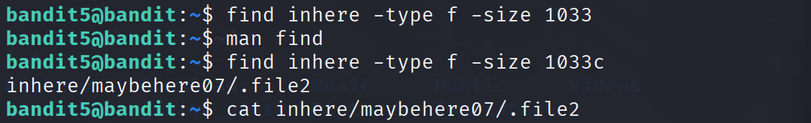
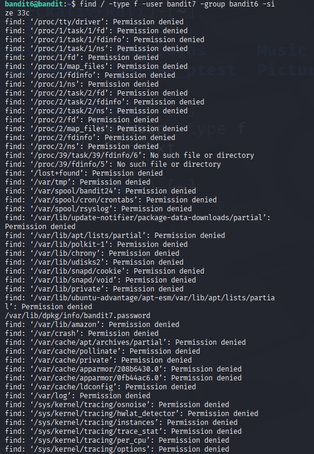
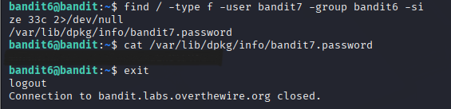
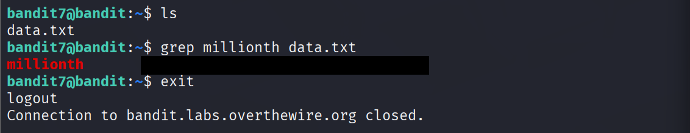
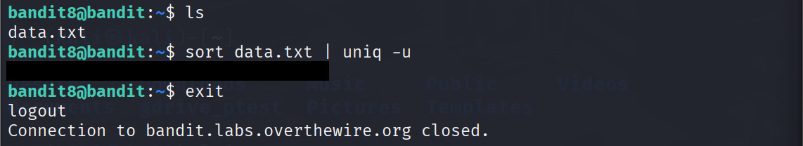
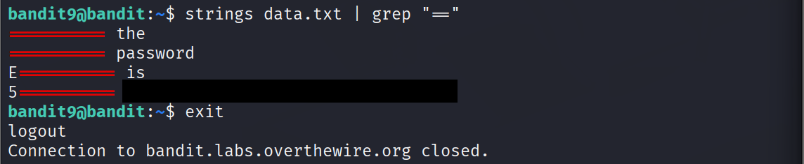

# OverTheWire Bandit Lab Report

### Session Date: 2026-02-19
### Levels Covered: 5 to 10 (Total solved so far: 10 / 34)
### Time Spent: 90 minutes (including debugging / reading man pages)
### Environment: Kali Linux VM
### SSH Connection: bandit5@bandit.labs.overthewire.org -p 2220 (fresh session)

# Objective & Relevance to Cybersecurity Roles (2026 Market)
In the 2026 cybersecurity job market, foundational Linux file system navigation, text processing, and pattern-matching skills demonstrated in Bandit levels 5–10 remain highly relevant across entry-to-mid-level roles such as SOC Analyst, Incident Responder, Digital Forensics Investigator, and Penetration Tester. Commands like find with advanced filters (size, ownership, hidden files), error suppression via 2>/dev/null, grep for keyword extraction, sort | uniq for deduplication and anomaly detection, and strings | grep for binary analysis directly translate to real-world tasks: locating hidden credentials or configs during privilege escalation (pentest/red team), hunting rare IOCs in large log datasets (threat hunting/SOC), suppressing noise in forensic file system searches (DFIR/IR), and quickly extracting potential C2 strings or keys from malware samples (malware/reverse engineering). These low-level proficiencies are still tested in interviews and required daily even as higher-level tools emerge, making consistent Bandit practice a strong differentiator for junior-to-mid roles in a competitive 2026 market.

# Level-by-Level Report

## Level 5 → Level 6 Password Retrieval
Official Goal (paraphrased):
The password for the next level is stored in a file somewhere under the inhere directory and has all of the following properties: human-readable, 1033 bytes in size, not executable.

Initial Approach:
Used find inhere -type f -size 1033 (without byte specifier).

Commands Executed (full sequence):
```bash
find inhere -type f -size 1033
man find
man find
find inhere -type f -size 1033c
cat inhere/maybehere07/.file2
```
Any errors faced?
First find without 'c' returned no results or incorrect matches (no explicit error pasted, but file not found).

How I debugged the issue
Read man find to understand size units → discovered 'c' for bytes.

Final working command
find inhere -type f -size 1033c followed by cat inhere/maybehere07/.file2

Password retrieval confirmation
[REDACTED]

Key Linux concept learned
Using find with precise size filters (-size Nc for bytes), locating hidden files (dotfiles), and effective use of man pages.

One cybersecurity job-role connection
Pentesting / red teaming – find with size/type/hidden-file filters is used post-exploitation to locate sensitive files, credential backups, or misconfigured .files in user directories or web roots.

## Level 6 → Level 7 Password Retrieval
Official Goal (paraphrased):
The password for the next level is stored somewhere on the server in a file owned by user bandit7, group bandit6, and exactly 33 bytes in size.

Initial Approach:
find / -type f -user bandit7 -group bandit6 -size 33c (but output was flooded with permission errors).

Commands Executed (full sequence):
```bash
find / -type f -user bandit7 -group bandit6 -size 33c
find / -type f -user bandit7 -group bandit6 -size 33c 2>/dev/null
cat /var/lib/dpkg/info/bandit7.password
exit
```
Any errors faced?
Initial command produced hundreds of "Permission denied" errors flooding the terminal.

How I debugged the issue
Recognized permission-denied noise → learned to redirect stderr with 2>/dev/null.

Final working command
find / -type f -user bandit7 -group bandit6 -size 33c 2>/dev/null then cat the path.

Password retrieval confirmation
[REDACTED]

Key Linux concept learned
Redirecting standard error (2>/dev/null) to clean up output during broad filesystem searches.

One cybersecurity job-role connection
Incident Response / Digital Forensics – find + ownership filters + error suppression is used to locate suspicious files (backdoors, droppers, credential stores) on compromised hosts without being overwhelmed by restricted areas.

## Level 7 → Level 8 Password Retrieval
Official Goal (paraphrased):
The password for the next level is stored in data.txt next to the word "millionth".

Initial Approach:
ls then directly grep millionth data.txt.

Commands Executed (full sequence):
```bash
ls
grep millionth data.txt
exit
```
Any errors faced?
N/A – no issue this session

How I debugged the issue
N/A – no issue this session

Final working command
grep millionth data.txt

Password retrieval confirmation
[REDACTED]

Key Linux concept learned
Efficient keyword search inside files using grep; credentials often placed next to identifiable strings in misconfigured systems.

One cybersecurity job-role connection
SOC Analyst / Threat Hunting – grep is used daily to search large log files, memory dumps, or config exports for specific IOCs (e.g., C2 domains, wallet addresses, exploit signatures).

## Level 8 → Level 9 Password Retrieval
Official Goal (paraphrased):
The password for the next level is stored in data.txt and is the only line of text that occurs exactly once (all other lines appear multiple times).

Initial Approach:
Tried grep first (forgot about uniq).

Commands Executed (full sequence):
```bash
ls
sort data.txt | uniq -u
exit
```

Any errors faced?
N/A – no issue this session (initial grep just not effective)

How I debugged the issue
Realized need for duplicate detection → switched to sort | uniq -u.

Final working command
sort data.txt | uniq -u

Password retrieval confirmation
[REDACTED]

Key Linux concept learned
Pipeline sort | uniq -u (or -c) to find unique/duplicate lines in large datasets.

One cybersecurity job-role connection
SOC Analyst / Threat Intelligence – sort | uniq pipelines help deduplicate and identify rare events/IPs/hashes/commands in logs or malware reports during hunting or analysis.

## Level 9 → Level 10 Password Retrieval
Official Goal (paraphrased):
The password for the next level is stored in data.txt in one of the few human-readable strings, preceded by several ‘=’ characters.

Initial Approach:
strings data.txt | grep "=" (single equals → noisy output).

Commands Executed (full sequence):
```bash
strings data.txt | grep "="
strings data.txt | grep "=="
exit
```
Any errors faced?
N/A – no issue this session (just noisy output from single =)

How I debugged the issue
Noticed too many matches → used more specific pattern "==".

Final working command
strings data.txt | grep "=="

Password retrieval confirmation
[REDACTED]

Key Linux concept learned
strings to extract printable text from binary files + precise grep patterns to reduce noise.

One cybersecurity job-role connection
Malware Analysis / Reverse Engineering – strings | grep is a staple first step to pull potential keys, URLs, or flags from binaries, memory dumps, or packed samples in threat intel/DFIR.

# Overall Session Learnings

What new commands did I learn today?
uniq (with -u), strings, 2>/dev/null redirection, more specific grep pattern usage, sort | uniq pipeline.

Any commands I used incorrectly first?
- find ... -size 1033 (missing c for bytes)
- find / ... without 2>/dev/null (noisy output)
- grep "=" (too broad/noisy) instead of "=="

Any concept I had to read man pages for?
find syntax (especially -size units like c for bytes).

Any efficiency improvement discovered?
- Suppressing errors with 2>/dev/null for cleaner find output
- Using more specific grep patterns to reduce false positives
- Piping commands (sort | uniq, strings | grep) for powerful one-liners

# Reflections & Next Steps

One mistake I made this session
Starting with overly broad patterns/filters (e.g., single = in grep, no error redirection in find) leading to noisy or useless output before refining.

One improvement for next session
Read the level goal more carefully first, then plan a precise command chain (including pipes and redirections) before executing trial-and-error.

Confidence rating (1–10)
8

Next planned level
10 to 14

# Images

- 


&nbsp;

- 

&nbsp;

- 

&nbsp;

- 

&nbsp;

- 

&nbsp;

- 