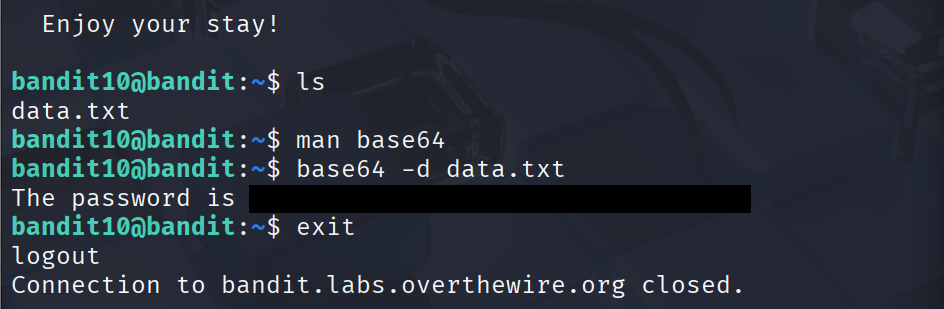
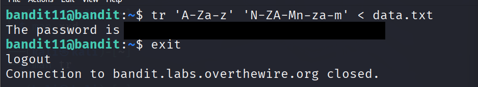
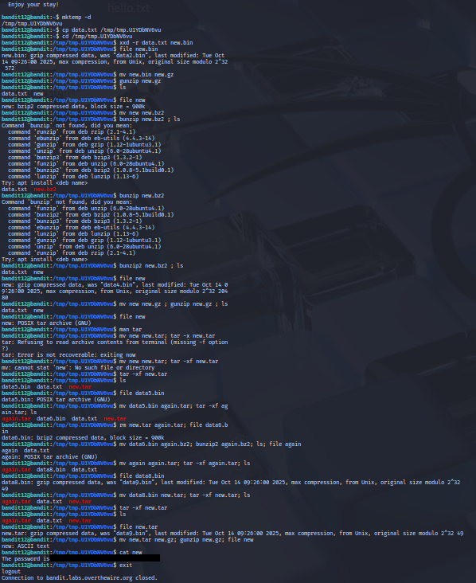
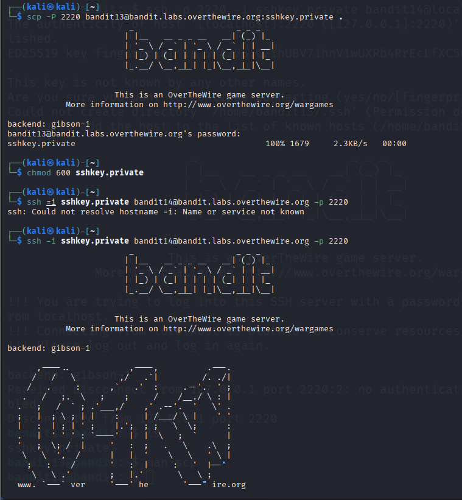
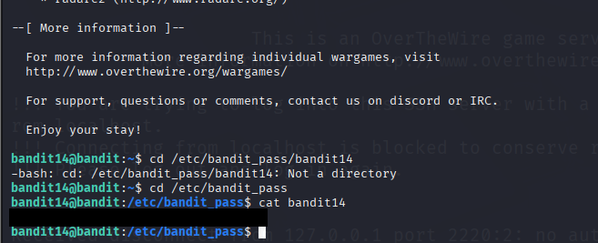
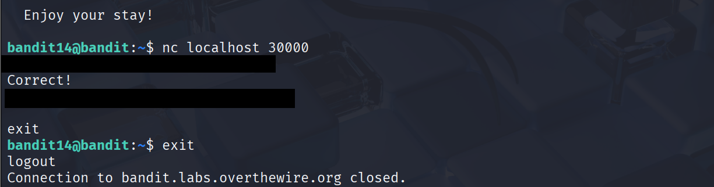

# OverTheWire Bandit: Levels 10–14 – 2026-02-20

**Session Overview**
- **Time spent:** 2 hours
- **Levels solved:** 10, 11, 12, 13, 14
- **Why does this matter for real cybersecurity roles?** Levels 10–14 teach encoding/decoding (base64, rot13), basic network client usage (netcat/nc), private key authentication (SSH without password), and layered file compression/archive handling (tar, gzip, bzip2). These are daily tools in real pentest engagements, CTF-style privesc, initial access credential hunting, lateral movement, and analyzing exfiltrated or dropped artifacts during red-team and incident response work.

**Level 10 → 11**
- **Commands used:** ```bash base64 -d data.txt ```
- **What happened:** The file data.txt contained base64-encoded text. Decoding revealed the password for bandit11.
- **Key learning:** Base64 encoding is ubiquitous for credential hiding, API tokens, and exfil payloads. base64 -d is the standard way to reverse it quickly on Linux.
- **Struggles & fixes :** No major issues; used man base64 to confirm the decode flag.



**Level 11 → 12**
- **Commands used:** ```bash tr 'A-Za-z' 'N-ZA-Mn-za-m' < data.txt ```
- **What happened:** File contained ROT13-obfuscated text. The tr command applied the correct character mapping to reveal the plaintext password.
- **Key learning:** ROT13 (and similar simple ciphers) still appears in CTFs, legacy code, and low-sophistication malware. tr excels at fast, inline character substitution.
- **Struggles & fixes :** Initial syntax confusion with ranges; resolved by testing small strings and verifying redirection.



**Level 12 → 13**
- **Commands used:** ```bash file <file>; xxd -r -p; tar -xvf <file.tar>; gunzip <file.gz>; bunzip2 <file.bz2> ``` (iterative/generalized)
- **What happened:** Started from a hexdump-reversed file, reversed it, then worked through multiple nested layers (gzip → bzip2 → tar) until reaching the plaintext password file.
- **Key learning:** Multi-stage compression/archive nesting is very common in real-world droppers, packed malware, and exfil bundles. Always use file after each step to guide the next tool.
- **Struggles & fixes :** Tried to treat gzip file as tar directly; missed reading file output carefully. Fixed by adopting a strict "file → decompress/extract → repeat" workflow.



**Level 13 → 14**
- **Commands used:** ```bash chmod 600 sshkey.private; ssh -i sshkey.private bandit14@localhost ```
- **What happened:** Used the provided private key to SSH as bandit14 on localhost (no passphrase required), then read the password file.
- **Key learning:** SSH private keys (especially passphrase-less) are a prime target for credential access and lateral movement in real environments. -i specifies the identity file.
- **Struggles & fixes :** Key file had incorrect permissions; fixed with chmod 600. Also resolved initial typos in command syntax.






**Level 14 → 15**
- **Commands used:** ```bash nc localhost 30000 ```
- **What happened:** Connected to the listening service on port 30000, sent the current password when prompted, and received the next level's password.
- **Key learning:** nc (netcat) is a Swiss-army knife for TCP/UDP interaction — banner grabbing, simple auth bypasses, reverse shells, port testing — foundational for enumeration and exploitation.
- **Struggles & fixes :** Minor typos in port/command; fixed by double-checking syntax and ensuring the service was active.



**Overall Realizations**
- **Illusion broken:** Many seemingly "secure" or complex protections are just basic encoding, weak key handling, or layered archives that standard tools unravel quickly.
- **Market tie-in:** These techniques map directly to MITRE ATT&CK techniques (T1552 Credential Access from Files, T1021 Remote Services via SSH, T1005 Data from Local System) and appear constantly in pentest findings, red-team playbooks, and junior/mid-level interview labs.
- **Mistakes summary:** Typo errors, incorrect filenames, attempting to treat gzip as tar without decompressing, not inspecting file command output thoroughly. Reinforced need for precision, full output reading, and methodical step-by-step validation.

**Next Steps**
- **Next levels target:** Levels 15–19
